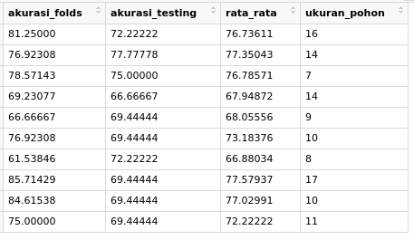

# algoritma-C5.0

### Hasil



# Hasil
```
Call:
C5.0.formula(formula = Klasifikasi.Desa ~ ., data = trainData)


C5.0 [Release 2.07 GPL Edition]  	Wed Nov 18 09:29:30 2020
-------------------------------

Class specified by attribute `outcome'

Read 124 cases (9 attributes) from undefined.data

Decision tree:

Jumlah.Penduduk > 1499:
:...Topologi = pegunungan: C (3)
:   Topologi = perbukitan: A (1)
:   Topologi = dataran:
:   :...Jarak <= 7:
:       :...BTS <= 1: B (5)
:       :   BTS > 1: C (2)
:       Jarak > 7:
:       :...Ketinggian <= 347: C (18/2)
:           Ketinggian > 347:
:           :...Jarak > 25: B (2)
:               Jarak <= 25:
:               :...Jumlah.Penduduk <= 2250: C (5/1)
:                   Jumlah.Penduduk > 2250: A (2)
Jumlah.Penduduk <= 1499:
:...Jarak > 33: B (34/3)
    Jarak <= 33:
    :...Jarak <= 14: B (19/1)
        Jarak > 14:
        :...Jumlah.Usaha > 38: C (3/1)
            Jumlah.Usaha <= 38:
            :...BTS <= 0: A (17)
                BTS > 0:
                :...Topologi = perbukitan: A (0)
                    Topologi = pegunungan: B (1)
                    Topologi = dataran:
                    :...Jumlah.Penduduk <= 1163: A (7)
                        Jumlah.Penduduk > 1163: B (5/1)


Evaluation on training data (124 cases):

	    Decision Tree   
	  ----------------  
	  Size      Errors  

	    15    9( 7.3%)   <<


	   (a)   (b)   (c)    <-classified as
	  ----  ----  ----
	    27     1     1    (a): class A
	          61     3    (b): class B
	           4    27    (c): class C


	Attribute usage:

	100.00%	Jumlah.Penduduk
	 96.77%	Jarak
	 41.13%	Topologi
	 29.84%	BTS
	 26.61%	Jumlah.Usaha
	 21.77%	Ketinggian


Time: 0.0 secs
```